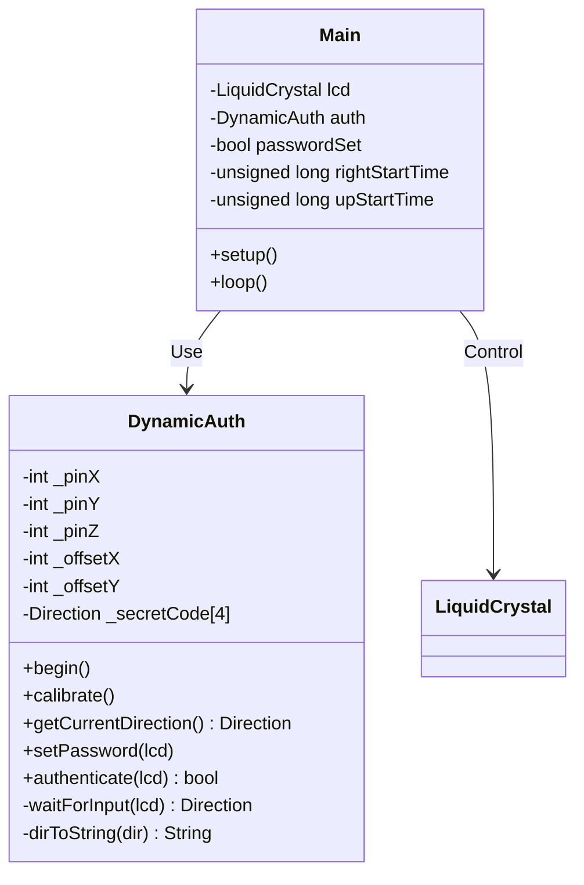
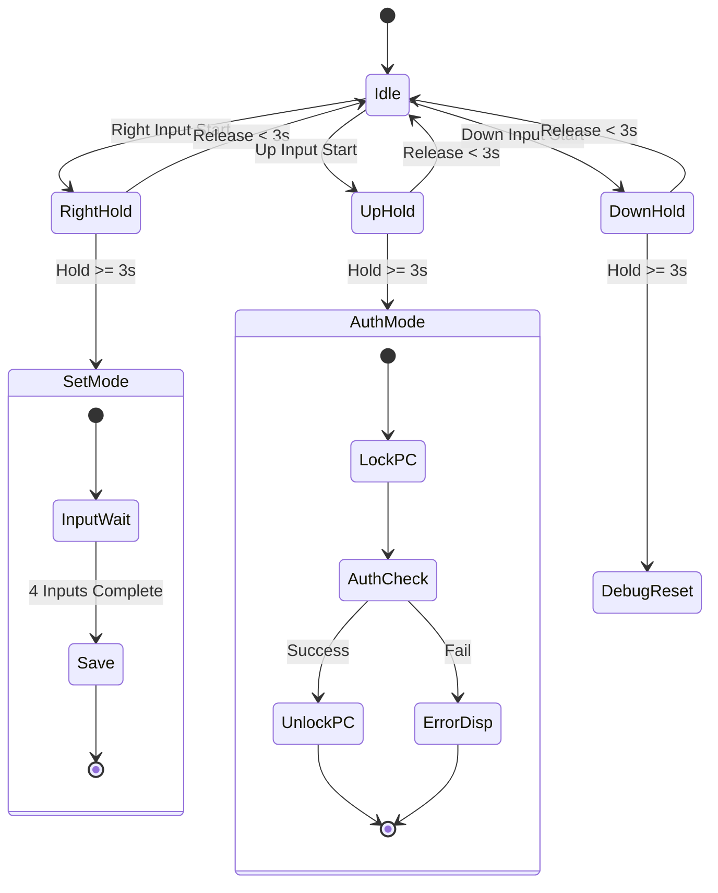
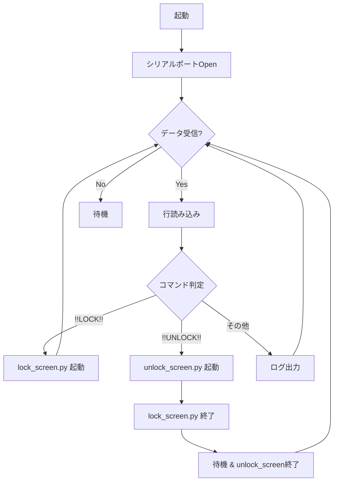

# 内部設計書 (Internal Design Document)

## 1. ソフトウェアアーキテクチャ

本システムのファームウェアは、Arduino Framework上で動作し、シングルスレッドのメインループによるポーリング制御を採用している。
主要な責務は **`main.cpp` (UI/状態管理)** と **`DynamicAuth` (ドメインロジック)** に分離されている。

### 1.1 クラス図 (Class Diagram)



## 2. モジュール詳細設計 (Firmware)

### 2.1 メイン処理 (`src/main.cpp`)

メインループ (`loop()`) では、ジョイスティックの現在の入力状態を監視し、長押し判定によるモード遷移を管理する。

#### 状態遷移 (State Machine)
非ブロッキングなタイマー処理により、長押し中も残り時間を表示する。



*   **グローバル変数:**
    *   `passwordSet` (bool): パスワードが設定済みかどうかを保持。未設定時は「Set」ガイドを表示。
    *   `isRightActive/isUpActive` (bool): 長押し判定用のフラグ。

### 2.2 認証ライブラリ (`lib/DynamicAuth`)

ジョイスティックの生値を処理し、抽象化された「方向」として扱う。

#### `getCurrentDirection()` / `waitForInput()`
アナログ値 (0-1023) を読み取り、キャリブレーション済みの中心値 (`_offsetX/Y`) との偏差を計算する。

*   **閾値判定:** 偏差の絶対値が `THRESHOLD (200)` を超えた場合に入力とみなす。
*   **軸判定:** X軸とY軸の偏差を比較し、大きい方を現在の入力方向とする。
*   **入力確定ロジック (`waitForInput`):**
    1.  方向入力を検知。
    2.  その後、入力がなくなる（`DIR_CENTER`に戻る）まで待機。
    3.  中心に戻った時点で「1回の入力」として確定し、リターンする。
    これにより、誤操作やチャタリングを防止している。

#### パスワード管理
*   **データ構造:** `enum Direction` の配列 `_secretCode[4]`。
*   **初期値:** `DIR_UP` x 4。
*   **揮発性:** EEPROM等への書き込みは実装されていないため、再起動でリセットされる。

## 3. ホストアプリケーション設計 (Python)

### 3.1 `listener.py`
シリアルポートを経由してPicoからのコマンドを受信し、外部プロセスを制御する。

#### 処理フロー


### 3.2 子プロセス管理
*   `subprocess.Popen` を使用して非同期にプロセスを起動する。
*   ロック解除時は、シームレスな体験のため以下の順序で処理する（`listener.py` L46-62）。
    1.  `unlock_screen.py` を起動（「解除しました」画面）。
    2.  `0.2s` 待機（描画待ち）。
    3.  `lock_screen.py` を `terminate()`。
    4.  `0.5s` 後に `unlock_screen.py` を終了。

## 4. データ構造と定数

### 4.1 Direction Enum (`DynamicAuth.h`)
```cpp
enum Direction {
    DIR_NONE = 0,
    DIR_UP,
    DIR_DOWN,
    DIR_LEFT,
    DIR_RIGHT,
    DIR_CENTER
};
```

### 4.2 コンフィグレーション (`main.cpp`)
*   `JoyStick_X/Y/Z`: 接続ピン番号。
*   `auth`: `DynamicAuth` インスタンス。`setup()`で`begin()`（キャリブレーション）が呼ばれる。

## 5. 制限事項・今後の課題

1.  **パスワードの永続化:** 現在は電源断でパスワードが消失する。`EEPROM.h` を利用してFlashメモリに保存する改修が推奨される。
2.  **セキュリティ:** PC側スクリプトはタスクマネージャ等で強制終了可能であるため、あくまで「簡易ロック」としての位置づけである。
3.  **入力タイムアウト:** パスワード入力待ち (`waitForInput`) にタイムアウトがないため、途中で放置すると操作不能になる（リセットが必要）。
