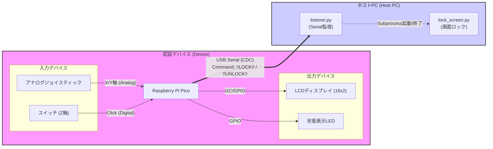
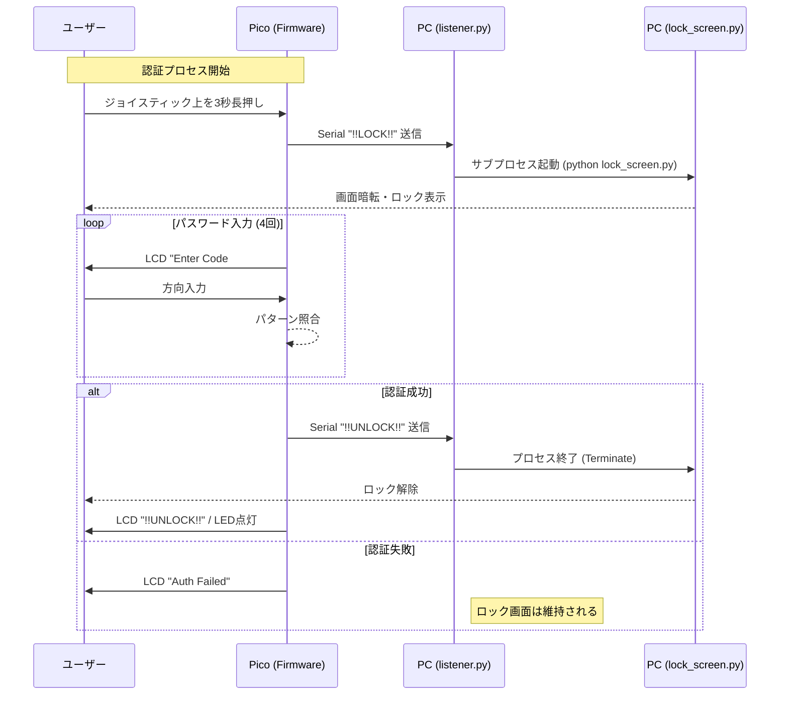

# システム構成図

このドキュメントでは、組み込みArduino認証システムのアーキテクチャについて説明します。

## 1. 全体構成図 (System Overview)

Raspberry Pi Picoを中心としたハードウェアデバイスと、PC上のPythonスクリプトが連携して動作します。

## 2. ソフトウェア構成 (Software Structure)

### ファームウェア (Raspberry Pi Pico)
- **Framework**: Arduino
- **Files**:
  - `src/main.cpp`: メイン制御ロジック。UI状態管理、周辺機器の初期化。
  - `lib/DynamicAuth/`: 認証ロジックライブラリ。
    - `DynamicAuth.h/cpp`: パスワード管理、入力パターン判定、キャリブレーション機能を提供。

### ホストアプリケーション (Python)
- **Files**:
  - `listener.py`: シリアルポート(`COM`/`/dev/tty*`)を監視し、コマンドに応じてロック画面を制御します。
  - `lock_screen.py`: `tkinter`を使用したフルスクリーンのロック画面オーバーレイ。

## 3. 処理シーケンス (Process Flow)

ユーザーが認証操作を行った際のデータの流れです。

## 4. 通信プロトコル

PicoとPC間はUSBシリアル通信（ボーレート設定に依存、listener.pyでは9600または115200を使用）で行われます。

| 送信元 | コマンド | 説明 |
|:---|:---|:---|
| Pico | `!!LOCK!!` | パソコンの画面をロックする（ロック画面アプリを起動） |
| Pico | `!!UNLOCK!!` | パソコンの画面をロック解除する（ロック画面アプリを終了） |
